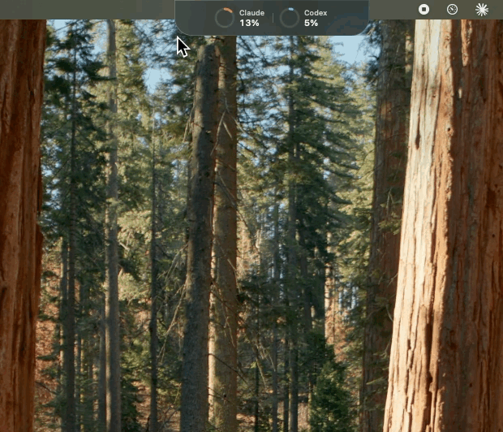

# Quotch

Claude and Codex quota, live in the macOS notch.



Hover to expand. Every quota the provider reports — session, weekly, and per-model caps
like Fable and Opus — read from their own servers, not estimated locally.

## Install

```
git clone https://github.com/DhurghamAhmed/Quotch.git
cd Quotch
./build.sh run
```

Needs macOS 14 or later and the Xcode command line tools (`xcode-select --install`).

On first launch macOS asks to read `Claude Code-credentials` from your keychain — choose
**Always Allow**. If a provider says "no login found", run `claude` or `codex` once in a
terminal and sign in, then pick **Refresh Now** from the menu bar.

## Notes

- Sources: `api.anthropic.com/api/oauth/usage` and `chatgpt.com/backend-api/wham/usage`.
- Credentials are read locally and sent only to the service that issued them.
- Drag the panel anywhere; it snaps to the nearest edge and remembers where it sat.
- Tests: `bash tests/run.sh`

## Licence

MIT © Dhurgham Ahmed
